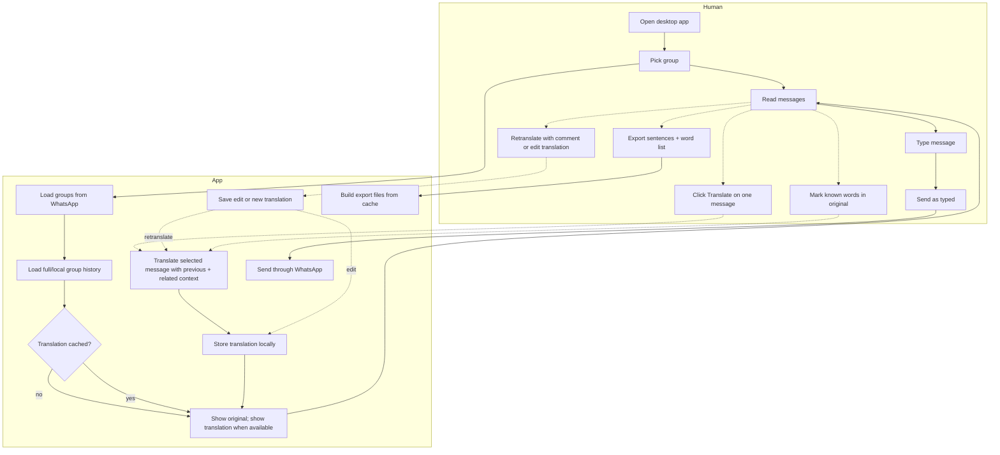
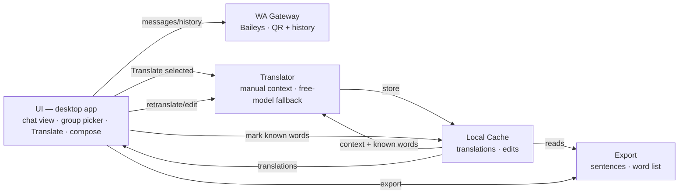

# system — spine

```mermaid
flowchart TD
  subgraph HUMAN["Human"]
    H1[Open desktop app] --> H2[Pick group]
    H2 --> H3[Read messages]
    H3 --> H4[Type message]
    H4 --> H5[Send as typed]
    H3 -.-> H9[Click Translate on one message]
    H3 -.-> H6[Retranslate with comment or edit translation]
    H3 -.-> H7[Export sentences + word list]
    H3 -.-> H8[Mark known words in original]
  end
  subgraph APP["App"]
    A1[Load groups from WhatsApp]
    A2[Load full/local group history]
    A3{Translation cached?}
    A4[Translate selected message with previous + related context]
    A5[Store translation locally]
    A6[Show original; show translation when available]
    A7[Send through WhatsApp]
    A8[Save edit or new translation]
    A9[Build export files from cache]
    A1 --> A2 --> A3
    A3 -- no --> A6
    A3 -- yes --> A6
  end
  H2 --> A1
  A6 --> H3
  H5 --> A7
  H9 -.-> A4
  A4 --> A5 --> A6
  H6 -.-> A8
  A8 -.->|edit| A5
  A8 -.->|retranslate| A4
  H7 --> A9
  H8 -.-> A4

  click A1 "modules/wa-gateway.md" "WA Gateway"
  click A2 "modules/wa-gateway.md" "WA Gateway"
  click A4 "modules/translator.md" "Translator"
  click A5 "modules/cache.md" "Local Cache"
  click A6 "modules/ui.md" "UI"
  click A7 "modules/wa-gateway.md" "WA Gateway"
  click A8 "modules/cache.md" "Local Cache"
  click A9 "modules/export.md" "Export"
```

```mermaid
flowchart LR
  UI["UI — desktop app<br/>chat view · group picker · Translate · compose"]
  GW["WA Gateway<br/>Baileys · QR + history"]
  TR["Translator<br/>manual context · free-model fallback"]
  CA["Local Cache<br/>translations · edits"]
  EX["Export<br/>sentences · word list"]
  UI -->|messages/history| GW
  UI -->|Translate selected| TR
  TR -->|store| CA
  CA -->|context + known words| TR
  CA -->|translations| UI
  CA -->|reads| EX
  UI -->|export| EX
  UI -->|retranslate/edit| TR
  UI -->|mark known words| CA

  click UI "modules/ui.md" "UI"
  click GW "modules/wa-gateway.md" "WA Gateway"
  click TR "modules/translator.md" "Translator"
  click CA "modules/cache.md" "Local Cache"
  click EX "modules/export.md" "Export"
```
